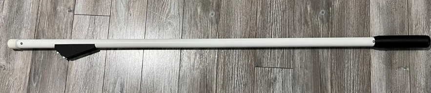
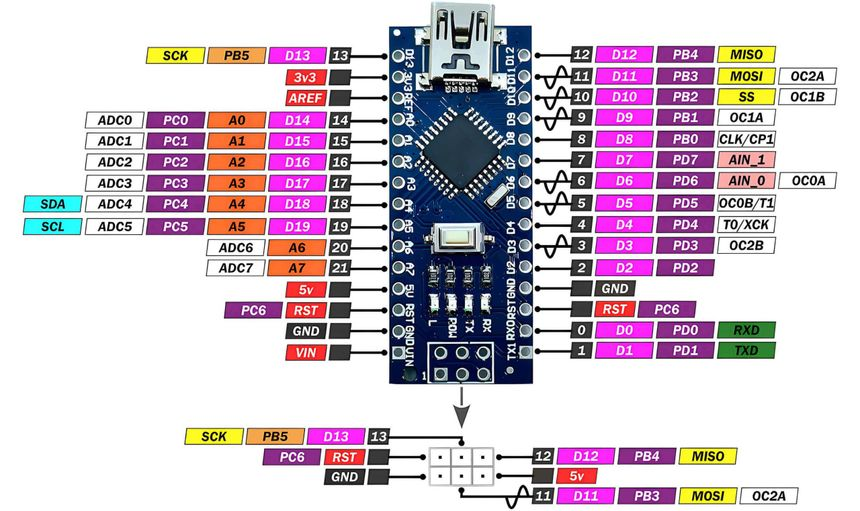
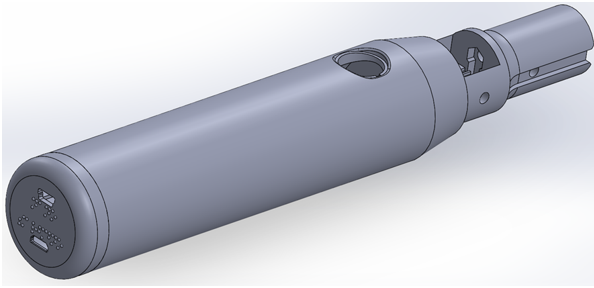
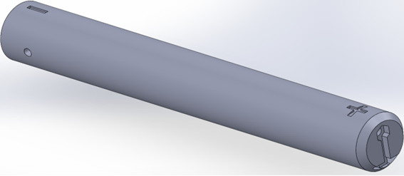
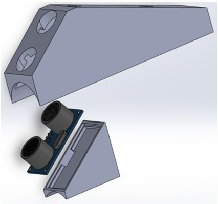
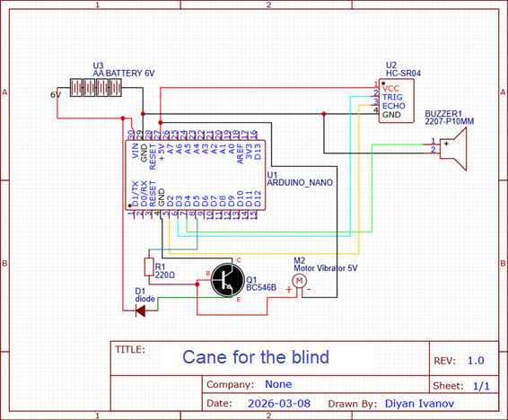

# Intelligent Assistive Walking Cane for the Visually Impaired 🦯🤖

[](https://www.arduino.cc/)
[-red?style=for-the-badge)](https://www.arduino.cc/)
[](#)

A smart, non-contact obstacle detection system designed to enhance the mobility and safety of visually impaired individuals. This project was developed as a graduation thesis to bridge the gap between traditional assistive tools and modern microcontroller technology.



*Figure 1: The completed Intelligent Walking Stick prototype.*

## 🌟 Overview
Traditional white canes rely on physical contact to detect obstacles. This device improves upon that design by using **ultrasonic waves** to detect objects at a distance, providing the user with preemptive warnings via **haptic (vibration)** and **acoustic (buzzer)** feedback.

### Key Benefits:
* **Early Detection:** Identifies obstacles before physical impact.
* **Dual Feedback:** Vibration for tactile awareness and sound for audible alerts.
* **Ergonomic:** Built using an **Arduino Nano** to ensure the circuitry is lightweight and fits within the cane handle.

## 🛠️ Hardware Specifications
| Component | Details |
| :--- | :--- |
| **Microcontroller** | **Arduino Nano** (ATmega328P) |
| **Sensor** | HC-SR04 Ultrasonic Sensor |
| **Alert System** | 5V Active Buzzer & DC Vibration Motor |
| **Power Supply** | **6V DC** (4 x 1.5V AAA/AA Batteries) |




## 🖨️ 3D Printed Design & Corpus
To transform the electronics into a durable tool, I designed custom 3D-printed housings. These components ensure the sensors are protected and the device is comfortable to hold.

| Component | Description | Preview |
| :--- | :--- | :--- |
| **Handle** | Ergonomic grip designed for long-term use. |  |
| **Battery Corpus** | Secure housing for the 6V battery pack (4x AAA). |  |
| **Sensor Corpus** | Protected mount for the HC-SR04 ultrasonic sensor. |  |

## 🚀 How it Works
The system measures the "Time of Flight" of an ultrasonic pulse to calculate the distance to the nearest object.

### The Detection Logic:
1. **Critical Zone (< 15cm):** Continuous vibration and a steady beep. Immediate stop required.
2. **Warning Zone (15cm - 50cm):** Intermittent pulses. The frequency of beeps/vibration increases as the user gets closer to the object.
3. **Safe Zone (> 50cm):** No feedback, allowing for clear movement.



*Figure 2: Wiring schematic showing the HC-SR04, Buzzer, and Motor connections.*

## 💻 Code Implementation
The project utilizes the `pulseIn()` function with a specific timeout to ensure the system remains responsive even if no echo is returned.

```cpp
// Distance calculation logic snippet
long duration = pulseIn(echoPin, HIGH, 30000); // 30ms timeout
float speedOfSound = 0.034; // cm per microsecond
int distance = duration * speedOfSound / 2;

if (distance > 0 && distance <= shortDistance) {
    digitalWrite(vibratorPin, HIGH); 
    digitalWrite(buzzerPin, HIGH); 
}
```

## 🏗️ Setup & Installation
1. **Hardware Assembly:** * Connect HC-SR04: `Trig` to D10, `Echo` to D11.
   * Connect Buzzer to D8 and Vibration Motor to D9.
   * Connect the 6V battery pack to `VIN` and `GND`.
2. **Software:** * Download the `.ino` file from this repository.
   * Open in Arduino IDE, select "Arduino Nano" as the board.
   * Upload and test!

## 🎓 Academic Background
This project was the subject of a comprehensive graduation thesis, covering:
* **Metrological Analysis:** Testing sensor accuracy and environmental interference.
* **Microcontroller Comparison:** Why the Nano was chosen over the Uno or Mega for wearable tech.
* **Social Impact:** The importance of accessible technology in modern society.

---
*Developed as a Graduation Project.*
